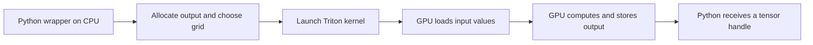

# 0. What are we programming?

**Time:** 30 minutes. **Prerequisite:** Python functions, lists and loops.
**Goal:** explain which work runs on the CPU, which work runs on the GPU, and
what the inputs and outputs of a kernel are.

## Start with an ordinary operation

```python
x = [1, 2, 3]
y = [10, 20, 30]
out = [x[i] + y[i] for i in range(3)]  # [11, 22, 33]
```

Each output can be computed independently. A GPU can assign independent pieces
to many execution units. It is not automatically faster: submitting a tiny job
has overhead, and moving data between CPU and GPU also costs time.

| Word | Meaning in this repo | Concrete example |
| --- | --- | --- |
| Host | The CPU and the Python process controlling work | Your wrapper decides the grid and allocates output |
| Device | The GPU running a submitted computation | The RTX 4080 SUPER |
| Tensor | Values plus shape, dtype, device and layout information | A 2-by-3 matrix of FP32 values on CUDA |
| Operator | A user-visible mathematical operation | `softmax(x)` |
| Kernel | One GPU program submitted for execution | The function decorated with `@triton.jit` |
| Launch | Submission of a kernel to the GPU | `kernel[grid](arguments)` |
| Grid | The number and arrangement of program instances | Three programs for 10 values in blocks of 4 |
| Program instance | One Triton instance processing a block of values | Program 2 handles logical offsets 8–11 |
| Thread / warp | CUDA execution units: a warp groups 32 NVIDIA threads | Many threads cooperate on one row reduction |
| Dtype | Representation and precision of each element | FP32 uses 4 bytes; FP16 and BF16 use 2 |

More terms are defined in the [glossary](../GLOSSARY.md) as you reach them.

A Triton block is a block of **values** described by your code. The compiler
maps those values to CUDA threads and registers. `BLOCK=256` does not mean that
your Python function is called 256 times, or that one program must use 256 threads.

## The two parts of a Triton operation



In words: the Python wrapper on the CPU allocates the output and chooses the grid,
then launches the kernel; the GPU loads inputs, computes and stores outputs, and
Python receives the output tensor. (The diagram renders on GitHub; some editors
show it as text.)

The wrapper normally returns before the GPU finishes. That is why a Python
stopwatch around a launch can measure submission time instead of computation.
We will address timing only after getting the math and addresses right.

## First commands

```bash
python --version
python -m learning.check --list
python -m learning.explain indexing
```

All three can run without GPU libraries, in PowerShell or WSL. Expected results:
a Python version of 3.10 or newer; a numbered list of ten exercises; and a table of
program, lane and offset values ending in two `masked out` rows.

Later, in the GPU environment, the check is `kernel-doctor` (or
`python -m kernel_portfolio.environment`). Its output should report
`"cuda_available": true` and an installed Triton version.

## Before continuing

Answer without jargon:

1. For vector addition, can output 5 be computed before output 4? Why?
2. Does a GPU kernel receive a Python list? What do the pointer arguments describe?
3. Why might adding only three numbers be faster on the CPU?
4. What remains on the CPU when you write a Triton kernel?

Check your reasoning in [ANSWER_KEY.md](../ANSWER_KEY.md#lesson-0), then continue
to [offsets and masks](01_indexing.md).
